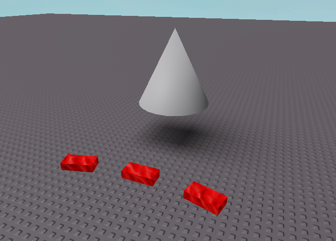

# Collection Service Testing Grounds

Generally trying to learn how to use Roblox's CollectionService and tagging Tool instances that can be managed via components or observers.



Generated by [Rojo](https://github.com/rojo-rbx/rojo) 7.4.1.

## Getting Started

To build from scratch, use:

```bash
rojo build -o "build.rbxlx"
```

Next, open `build.rbxlx` in Roblox Studio and start the Rojo server:

```bash
rojo serve
```

For more help, check out [the Rojo documentation](https://rojo.space/docs) (or don't :P).
